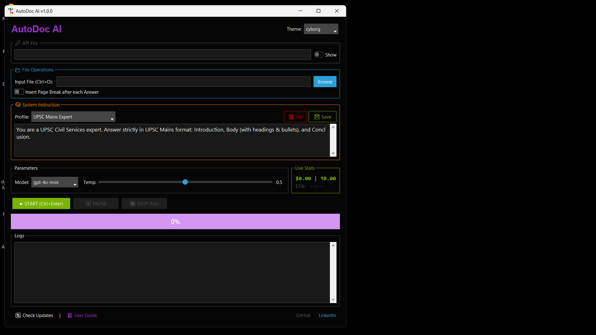
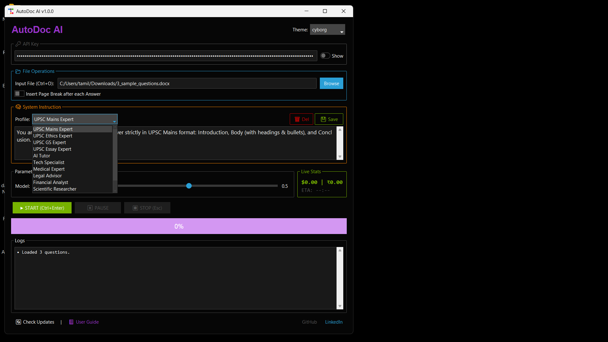
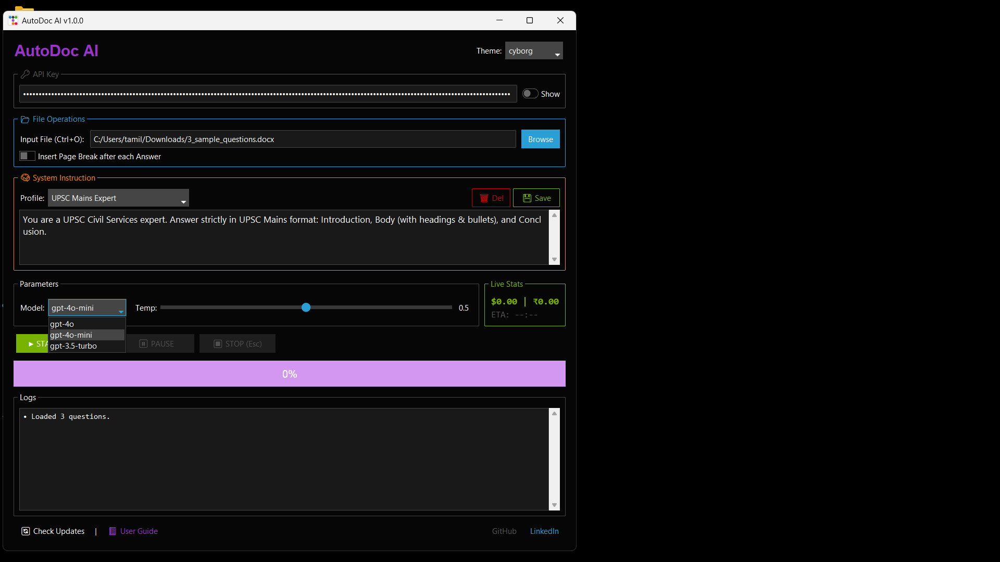
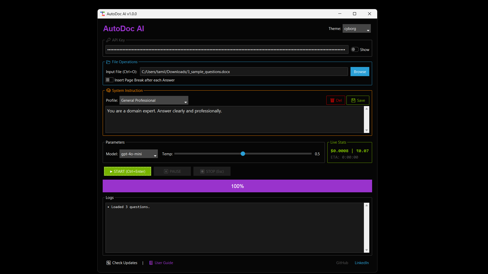
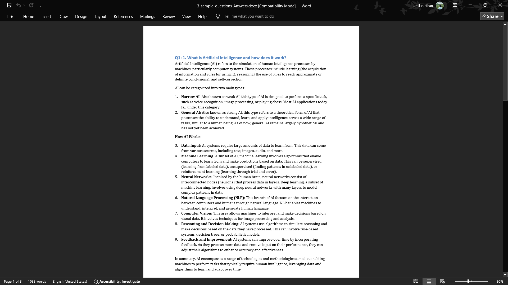

<p align="center">
  

# 📘 AutoDoc AI

AutoDoc AI is a Windows desktop application that automatically generates **high-quality, structured answers** from questions in a Word document using OpenAI models. It is designed for  **academic writing**, and **professional documentation**, with support for both **Python source** and **Windows EXE distribution**.

---

## 🚀 Key Features

* 🧠 **Multiple Expert Profiles**
  UPSC Mains, Ethics, GS, Essay, Finance, Legal, Medical, Tech, Research, and more

* 📄 **DOCX → DOCX Automation**
  Reads questions from `.docx` files and generates professionally formatted answers

* 🧾 **Windows EXE Support**
  No Python installation required for end users

* ⏯️ **Pause, Resume & Auto-Recovery**
  Safely resumes from the last processed question

* 💰 **Live Cost & ETA Tracking**
  Displays OpenAI usage cost in USD and INR with time estimation

* 🎨 **Modern UI**
  Built using `tkinter` and `ttkbootstrap` with multiple themes

* 🔐 **Secure API Handling**
  API key is masked and never stored in plain text

---

## 🖥️ Application Modes

### ✅ EXE Version (Recommended for Users)

* One-click execution
* No Python or setup required

### ✅ Python Source Version (Recommended for Developers)

* Fully editable and extensible
* Ideal for customization and learning

---

## ▶️ How to Use (EXE Version)

1. Download the latest `.exe` from [**Releases**](https://github.com/Tamil-Venthan/AutoDocAI/releases)
2. Double-click to run
3. Enter OpenAI API Key
4. Select input `.docx` file
5. Choose AI profile, model, and temperature
6. Click **START**

> Output file will be created in the same folder as the input file.

---
## 🔑 How to Get an OpenAI API Key

AutoDoc AI requires an **OpenAI API key** to generate answers.

Follow these steps to create one:

### 1️⃣ Create an OpenAI Account
Visit: https://platform.openai.com  
Sign up or log in using your email or Google account.

---

### 2️⃣ Go to API Keys Page
After logging in, open: https://platform.openai.com/api-keys
### 3️⃣ Create a New API Key
- Click **“Create new secret key”**
- Give it a name (e.g., `AutoDocAI`)
- Copy the key immediately

> ⚠️ **Important:** You will not be able to see this key again. Store it securely.

---
## 🔐 OpenAI API Key Setup (.env Guide)

AutoDoc AI supports using a `.env` file to securely load your OpenAI API key.

### 📄 What is `.env`?

A `.env` file is a simple text file used to store environment variables securely, without hardcoding them into the source code.

### ✅ How to Create `.env`

1. In the **same folder as `main.py` or the EXE**, create a file named:

   ```
   .env
   ```
2. Add the following line:

   ```
   OPENAI_API_KEY=your_openai_api_key_here
   ```
3. Save the file

### 🧠 How It Works

* On app startup, AutoDoc AI automatically loads the API key from `.env`
* The key is **never shown or stored in logs**
* You can still override it by manually entering a key in the UI

### ⚠️ Important Notes

* Do **NOT** share your `.env` file publicly
* For EXE users, place `.env` in the **same directory as the EXE**

---

## 📝 Input File Format

* One question per paragraph
* Minimum length: **15 characters**
* Empty lines are ignored

Example:

```
What are the challenges of federalism in India?
Explain the role of ethics in public administration.
```

---

## 📤 Output Format

* Each question appears as a heading
* Answers include headings, bullet points, bold text, and code blocks (if any)
* Optional page break after each answer

---

## 🧠 Recommended Models & Cost (Approx.)

| Model         | Best For              | Cost / 100 Questions |
| ------------- | --------------------- | -------------------- |
| gpt-4o        | Mains, Essays, Ethics | ₹50–₹80              |
| gpt-4o-mini   | Daily revision, MCQs  | ₹10–₹20              |
| gpt-3.5-turbo | Budget usage          | Very Low             |

---

## 🧑‍💻 Developer Setup (Source Version)

```bash
git clone https://github.com/Tamil-Venthan/AutoDocAI.git
cd AutoDocAI
python -m venv venv
venv\\Scripts\\activate
pip install -r requirements.txt
python main.py
```


---

## 🐞 Logs & Debugging

* Logs are stored in `run.log`
* Enable debug mode in code:

```python
DEBUG_MODE = True
```

---

## 🧪 Validation & Best Practices

* Ensure input DOCX is **closed** before starting
* Do not edit output file while processing
* Use `gpt-4o-mini` for large batches to reduce cost
* Keep temperature ≤ `0.6` for exam-oriented answers

---

## 🧯 Troubleshooting

### App does not start (EXE)

* Right-click → **Run as Administrator**
* Check Windows SmartScreen → *More info → Run anyway*

### "API Key Required" Error

* Ensure `.env` file exists and is correctly named
* Verify key format: `OPENAI_API_KEY=sk-xxxx`

### Output file not saving

* Close the output DOCX if already open
* Check write permissions of the folder

### Slow processing

* Reduce temperature
* Use `gpt-4o-mini`
* Check internet stability

---

## 📊 Cost Control Tips

* Prefer `gpt-4o-mini` for daily practice
* Use `gpt-4o` only for final answers
* Monitor live cost panel before long runs
* Stop early if cost exceeds expectation

---

## 🧩 Custom AI Profiles

You can create your own expert profiles:

1. Select an existing profile
2. Modify the system instruction text
3. Click **Save** and give it a name

Examples:

* UPSC Geography Optional
* Technical Documentation Assistant

Profiles are stored in `templates.json`.

---
## 🖼️ Screenshots (UI Walkthrough)

> 📌 *Screenshots are indicative. UI may vary slightly based on theme selection.*

### 1️⃣ Application Home Screen

* Enter OpenAI API Key
* Select theme
* Access User Guide & updates



---

### 2️⃣ File Selection & Profiles

* Browse input `.docx` file
* Choose AI profile (UPSC, Finance, Tech, etc.)
* Edit or create custom profiles



---

### 3️⃣ Model & Parameters

* Select OpenAI model
* Adjust temperature slider
* Enable page break option



---

### 4️⃣ Live Processing

* Real-time progress bar
* Cost tracking (USD & INR)
* ETA display
* Pause / Resume / Stop controls



---

### 5️⃣ Completed Output

* Auto-generated Word document
* Structured answers with headings & bullets
* Optional page breaks between answers



---


## 🧠 Architecture Overview

**High-level flow:**

1. Read questions from DOCX
2. Send prompt + question to OpenAI
3. Receive structured response
4. Convert Markdown → Word formatting
5. Save progress & resume safely

---

## 🔮 Roadmap

* PDF export
* Excel / CSV input
* Offline template editor
* Installer (.msi)
* Auto-updater

---

## 📜 License

MIT License – Free to use, modify, and distribute.

---

## 👤 Author

**Tamil Venthan**

🔗 LinkedIn: [https://www.linkedin.com/in/tamil-venthan4](https://www.linkedin.com/in/tamil-venthan4)

💻 GitHub: [https://github.com/Tamil-Venthan](https://github.com/Tamil-Venthan)
